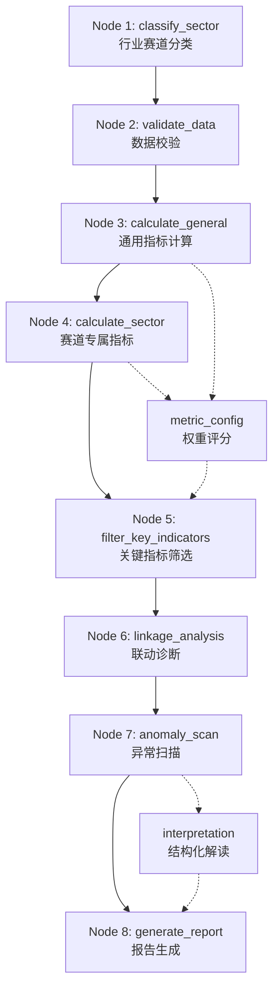
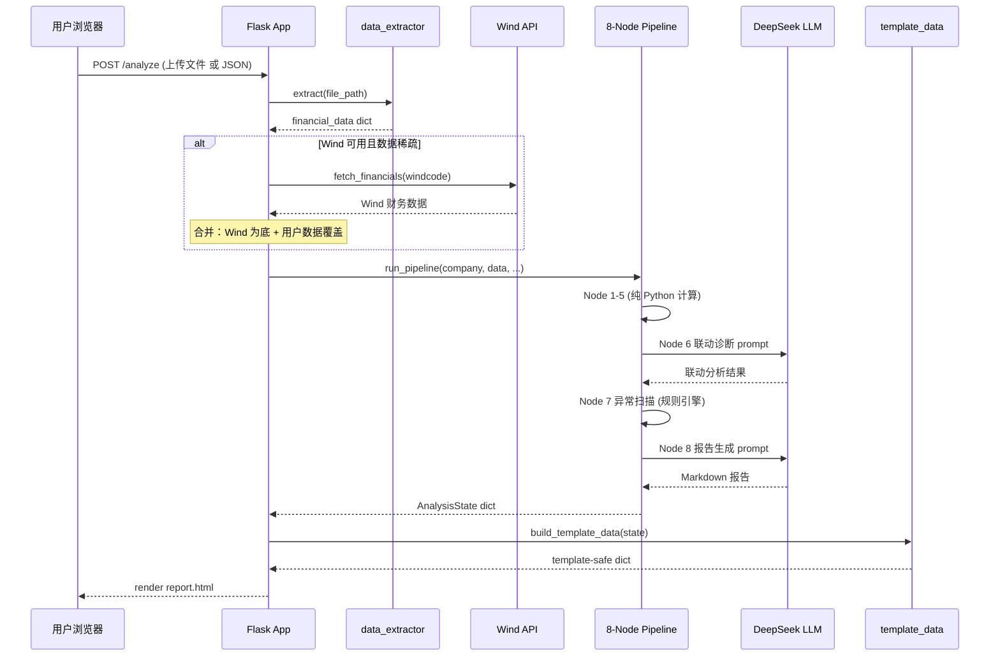

# FinAgent-Lithium 系统架构

## 1. 系统概述

FinAgent-Lithium 是一套面向锂电池行业的财务报表智能分析系统。用户上传年报/财报（Excel 或 PDF），系统通过 8 节点流水线自动完成赛道分类、指标计算、联动诊断、异常扫描和报告生成，最终在 Web 界面呈现可视化分析报告。系统可选对接 Wind 金融数据终端获取实时财务数据和同业对比，也可在无 Wind 环境下以用户上传数据独立运行。

## 2. 技术栈

| 层级 | 技术 | 用途 |
|------|------|------|
| Web 框架 | Flask 3.x | 路由、模板渲染、文件上传 |
| 流水线编排 | 自研 8 节点顺序管道 | 分析状态在节点间传递（LangGraph 设计理念） |
| LLM | DeepSeek API（`api.deepseek.com/anthropic`） | 联动诊断、宏观分析、报告润色、追问问答 |
| 金融数据 | Wind API（可选） | 实时财务数据拉取、同业对比、碳酸锂价格 |
| 前端渲染 | Jinja2 + Plotly.js | 服务端模板 + 客户端交互图表 |
| 数据处理 | pandas + openpyxl | Excel 财务数据提取与清洗 |

## 3. 8 节点分析流水线

所有节点定义在 `nodes/` 目录，由 `web/workflow.py` 中的 `run_pipeline()` 顺序编排。每个节点接收并扩充一个共享的 `AnalysisState` 字典。



### 各节点职责

| # | 节点 | 文件 | 输入 | 输出 | Python/LLM |
|---|------|------|------|------|-----------|
| 1 | **classify_sector** | `nodes/classify_sector.py` | 公司名、股票代码、主营业务关键词 | `sector_level1/2`、`sub_sectors`、`_sector_code` | 纯 Python（知识库匹配） |
| 2 | **validate_data** | `nodes/validate_data.py` | 财务数据字典、附注数据 | `data_completeness`、`error_log` | 纯 Python（字段覆盖率检查） |
| 3 | **calculate_general** | `nodes/calculate_general.py` | 财务数据、附注数据 | `general_indicators`（11 项通用指标） | 纯 Python（公式计算） |
| 4 | **calculate_sector** | `nodes/calculate_sector.py` | 财务数据、赛道分类 | `sector_indicators`（赛道专属指标） | 纯 Python（公式计算） |
| 5 | **filter_key_indicators** | `nodes/filter_key_indicators.py` | 通用+赛道指标 | `key_indicators_for_linkage`（高权重/异常指标） | 纯 Python（阈值筛选） |
| 6 | **linkage_analysis** | `nodes/linkage_analysis.py` | 关键指标、赛道特征 | `linkage_diagnosis`（因果链诊断） | **LLM**（DeepSeek 联动推理） |
| 7 | **anomaly_scan** | `nodes/anomaly_scan.py` | 全部指标、宏观上下文 | `anomaly_signals`（异常信号列表） | 纯 Python（规则引擎） |
| 8 | **generate_report** | `nodes/generate_report.py` | 全部分析结果 | `report_markdown`（Markdown 报告） | **LLM**（DeepSeek 报告生成） |

### 辅助模块

| 模块 | 文件 | 职责 |
|------|------|------|
| **interpretation** | `nodes/interpretation.py` | 将计算结果转为结构化解读对象（指标解读、宏观洞察、行业对标） |
| **metric_config** | `nodes/metric_config.py` | 加载 `metric_weight_config.json` 权重配置，计算加权评分，行业对标 |
| **llm_client** | `nodes/llm_client.py` | DeepSeek API 调用封装 |
| **wind_adapter** | `nodes/wind_adapter.py` | Wind API 适配层（财务数据、公司信息、碳酸锂价格、同业数据） |
| **data_extractor** | `nodes/data_extractor.py` | Excel/PDF 财务报表数据提取 |
| **lithium_kb** | `lithium_kb.py` | 锂电行业知识库加载（赛道定义、阈值、指标配置） |

## 4. Web 架构

```
web/
├── app.py              # Flask 入口：创建 app、注册 Blueprint、健康检查
├── workflow.py          # 流水线编排：run_pipeline()、知识库加载、Wind 增强
├── template_data.py     # 状态 → 模板数据转换（不涉及 HTTP 逻辑）
├── shared_state.py      # 内存报告存储（REPORT_HISTORY / REPORT_STATES）
├── routes/
│   ├── __init__.py      # register_blueprints() 统一注册
│   ├── analysis.py      # 主分析流程：首页、上传分析、API 分析、Demo、报告下载
│   ├── followup.py      # 追问问答：/api/ask
│   ├── history.py       # 历史报告：/api/history、/report/<id>
│   └── peers.py         # 同业对比：文件对比 /compare、Wind 对比 /api/peer-compare
├── templates/
│   ├── index.html       # 首页（数据输入表单、历史面板、问答面板）
│   ├── report.html      # 分析报告展示页
│   ├── compare.html     # 同业对比结果页
│   └── partials/        # 模板片段
└── static/
    ├── css/             # 样式文件
    └── js/
        ├── workbench.js # 首页交互逻辑
        └── report.js    # 报告页交互逻辑（图表、折叠、追问）
```

### 设计决策

- **Blueprint 拆分**：每个 Blueprint 对应一个功能域（分析、追问、历史、同业），路由文件保持精简可测。
- **template_data.py 分离**：所有 `AnalysisState -> template data` 的转换逻辑集中在此，路由层只负责 HTTP 协议。
- **shared_state.py 共享**：`REPORT_HISTORY`（deque, maxlen=20）和 `REPORT_STATES`（dict）由多个 Blueprint 读写，因此提取为独立模块。
- **后向兼容**：`web/app.py` 保留 `_build_template_data`、`_REPORT_HISTORY`、`_REPORT_STATES` 的 re-export，避免外部代码（如 `api/index.py`、测试）因重构而崩溃。

## 5. 数据流



### 关键数据结构

- **`AnalysisState`**：贯穿整个流水线的字典，每个节点向其追加字段（`sector_level1`、`general_indicators`、`anomaly_signals` 等）。
- **`IndicatorResult`**：每个指标的标准结构，包含 `value`、`unit`、`risk_level`、`normal_range`、`formula`、`weight` 等字段。
- **`REPORT_STATES`**：内存字典，键为 12 位 UUID 短串，值为完整 `AnalysisState`，用于历史浏览和追问问答。

## 6. 外部集成

### Wind API（可选）

Wind 万得金融数据终端的集成通过 `nodes/wind_adapter.py` 实现，受环境变量控制：

| 环境变量 | 说明 | 默认值 |
|----------|------|--------|
| `WIND_ENABLE_CONTEXT` | 启用宏观/同业上下文拉取 | `0`（关闭） |
| `WIND_FINANCIAL_TIMEOUT_SECONDS` | 财务数据拉取超时 | `12` |
| `WIND_CONTEXT_TIMEOUT_SECONDS` | 上下文数据拉取超时 | `6` |
| `WIND_PEER_CODES` | 逗号分隔的同业 Wind 代码 | 内置 5 家龙头 |
| `WIND_PEER_MAX` | 同业数据最大拉取数 | `2` |

Wind 集成点：
- **财务数据拉取**：当用户提供股票代码但未上传文件时，自动从 Wind 拉取最新财务数据
- **赛道分类增强**：通过 Wind 获取公司主营业务关键词辅助分类
- **碳酸锂价格趋势**：用于异常扫描的外部宏观规则
- **同业财务数据**：行业对标和雷达图对比

**降级策略**：Wind 不可用时，所有 Wind 相关功能静默跳过，系统回退到用户上传数据 + DeepSeek 宏观分析。

### DeepSeek API

通过 `nodes/llm_client.py` 封装调用，用于：
- Node 6 联动诊断（因果链推理）
- Node 8 报告生成（Markdown 报告润色）
- 宏观背景分析（Wind 不可用时的 fallback）
- 追问问答（`/api/ask` 端点）

**降级策略**：LLM 不可用时，联动诊断返回基于规则的简要结果，报告使用模板化 fallback，追问返回基于已计算指标的确定性回答。

## 7. 局限性

| 局限 | 说明 |
|------|------|
| **无持久化存储** | 报告历史存储在内存中（`deque(maxlen=20)`），服务重启后丢失 |
| **无实时数据（无 Wind 时）** | 不接入 Wind 时，系统只能分析用户上传的静态报表数据 |
| **单进程内存状态** | `shared_state.py` 基于进程内字典，不支持多 worker 部署 |
| **锂电行业专属** | 知识库、赛道分类、专属指标均针对锂电池产业链设计 |
| **LLM 依赖** | 联动诊断和报告生成的质量依赖 DeepSeek API 可用性和响应质量 |
| **文件格式限制** | 数据提取仅支持 Excel (.xlsx) 和 PDF 格式 |
| **同业对比上限** | 文件上传对比最多 8 家公司 |
